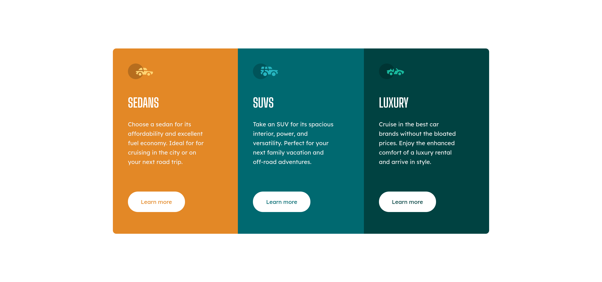
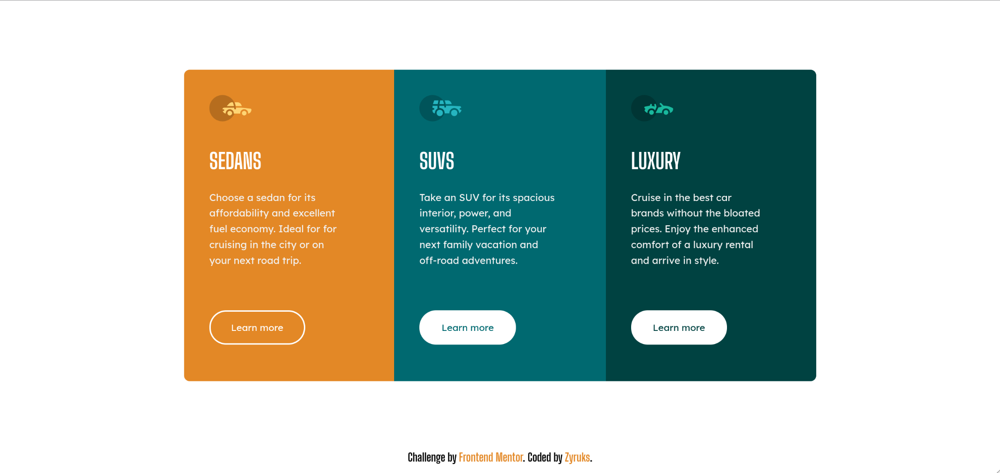

# Frontend Mentor - 3-column preview card component solution

This is a solution to the [3-column preview card component challenge on Frontend Mentor](https://www.frontendmentor.io/challenges/3column-preview-card-component-pH92eAR2-). Frontend Mentor challenges help you improve your coding skills by building realistic projects.

## Table of contents

- [Overview](#overview)
  - [The challenge](#the-challenge)
  - [Screenshot](#screenshot)
  - [Links](#links)
- [My process](#my-process)

  - [Built with](#built-with)

  - [Continued development](#continued-development)

- [Author](#author)

## Overview

### The challenge

Users should be able to:

- View the optimal layout depending on their device's screen size
- See hover states for interactive elements

### Screenshot

  
  
  

### Links

- Solution URL: [GitHub](https://github.com/Zyruks/3-column-preview-card-component)
- Live Site URL: [Vercel](https://3-column-preview-card-component-zyruks.vercel.app/)

## My process

### Built with

- SASS Pre-processor
- CSS custom properties
- Flex-box
- Responsive Image - Picture Tag
- Mobile-first workflow
- Vanilla Javascript
- [Gulp](https://gulpjs.com/) - WorkFlow
- [Pnpm](https://pnpm.io/) - Package Manager

### Continued development

My DOM Manipulation with Js

## Author

- Website - [Samuel Llibre Santos](https://www.zyruks.com)
- Frontend Mentor - [@zyruks](https://www.frontendmentor.io/profile/Zyruks)
- Twitter - [@zyruks](https://www.twitter.com/zyruks)
