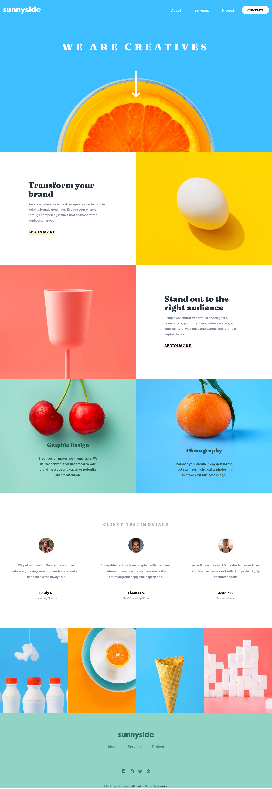
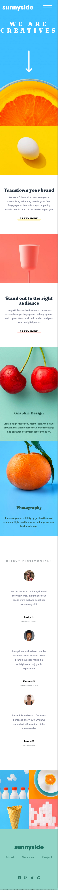

# Frontend Mentor - Sunnyside agency landing page solution

This is a solution to the [Sunnyside agency landing page challenge on Frontend Mentor](https://www.frontendmentor.io/challenges/sunnyside-agency-landing-page-7yVs3B6ef). Frontend Mentor challenges help you improve your coding skills by building realistic projects.

## Table of contents

- [Overview](#overview)
  - [The challenge](#the-challenge)
  - [Screenshot](#screenshot)
  - [Links](#links)
- [My process](#my-process)
  - [Built with](#built-with)
  - [What I learned](#what-i-learned)
  - [Continued development](#continued-development)
  - [Useful resources](#useful-resources)
- [Author](#author)

## Overview

### The challenge

Users should be able to:

- View the optimal layout for the site depending on their device's screen size
- See hover states for all interactive elements on the page

Additional i added some animations.

### Screenshot

<div style="display:flex; gap: 1rem; ">


</div>

### Links

- Solution URL: [Github](https://github.com/Zyruks/Sunnyside-Project-Frontend-Mentor)
- Live Site URL: [Vercel](https://sunnyside-project-frontend-mentor-ajocpda2p-zyruks.vercel.app/)

## My process

### Built with

- Semantic HTML5 markup
- SCSS
- GULP
- Vanilla Js
- Stylelint
- BEM
- CSS custom properties
- Flexbox
- CSS Grid
- Mobile-first workflow

### What I learned

With this challenge i got more experience working with background properties but with the experience i got from graphic design at last i manage.

```
img {
  background-repeat: no-repeat;
  background-position: center top;
  background-size: cover;
  background-image: url("../assets/images/mobile/image-graphic-design-og.jpg");
  }
```

### Continued development

Doing more stuff with background properties. Got some ideas for new projects now.

### Useful resources

- [CSSTRICK](https://css-tricks.com/almanac/properties/b/background/) - This help with the understanding of background properties.

## Author

- Website - [Zyruks](https://www.zyruks.com)
- Frontend Mentor - [@zyruks](https://www.frontendmentor.io/profile/zyruks)
- Twitter - [@zyruks](https://www.twitter.com/zyruks)
