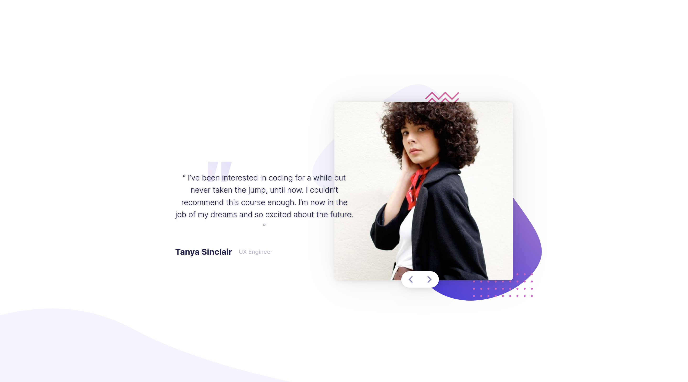

# Frontend Mentor - Coding bootcamp testimonials slider solution

This is a solution to the [Coding bootcamp testimonials slider challenge on Frontend Mentor](https://www.frontendmentor.io/challenges/coding-bootcamp-testimonials-slider-4FNyLA8JL). Frontend Mentor challenges help you improve your coding skills by building realistic projects.

## Table of contents

- [Overview](#overview)
  - [The challenge](#the-challenge)
  - [Screenshot](#screenshot)
  - [Links](#links)
- [My process](#my-process)
  - [Built with](#built-with)
  - [What I learned](#what-i-learned)
  - [Continued development](#continued-development)
  - [Useful resources](#useful-resources)
- [Author](#author)
- [Acknowledgments](#acknowledgments)

## Overview

### The challenge

Users should be able to:

- View the optimal layout for the component depending on their device's screen size
- Navigate the slider using either their mouse/trackpad or keyboard

### Screenshot

  
  

### Links

- Solution URL: [Github](https://github.com/Zyruks/easybank-landing-page/tree/main)
- Live Site URL: [Vercel](https://testimonial-slider-cqw4-zyruks.vercel.app/)

## My process

### Built with

- Semantic HTML5 markup
- CSS custom properties
- Mobile-first workflow
- CUBE-CSS
- BEM Naming Convention
- Vanilla Javascript
- Grid
- Media Queries
- SASS
- [Tokenization](https://css-tricks.com/what-are-design-tokens/)
- Gulp
- pnpm

### What I learned

is my first time trying to make a carrousel type of design and at first i try using position absolute for the second card and it work but card weren't align on the Y Axis. Them i try using Grid and putting the content on the same columns and move the second card with transform property.

Perfectly done ;)

### Useful resources

- [CSS GRID](https://css-tricks.com/snippets/css/complete-guide-grid/)
- [Transform](https://css-tricks.com/almanac/properties/t/transform/)

## Author

- Website - [Zyruks](https://www.zyruks.com)
- Frontend Mentor - [@Zyruks](https://www.frontendmentor.io/profile/Zyruks)
- Twitter - [@Zyruks](https://www.twitter.com/Zyruks)

## Acknowledgments

Is always good to keep a open mind on how to approach a design. Don't get stuck with the thing you already know and try new combinations.
