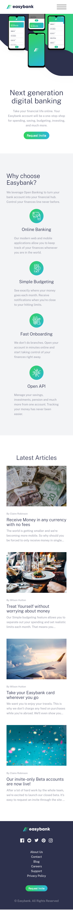
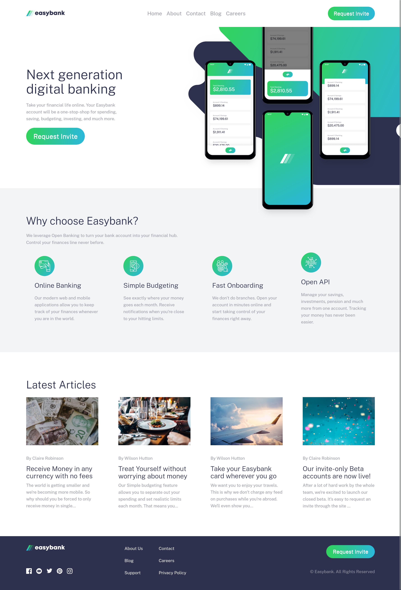

# Frontend Mentor - Easybank landing page solution

This is a solution to the [Easybank landing page challenge on Frontend Mentor](https://www.frontendmentor.io/challenges/easybank-landing-page-WaUhkoDN). Frontend Mentor challenges help you improve your coding skills by building realistic projects.

## Table of contents

- [Overview](#overview)
  - [The challenge](#the-challenge)
  - [Screenshot](#screenshot)
  - [Links](#links)
- [My process](#my-process)

  - [Built with](#built-with)
  - [Useful resources](#useful-resources)

- [Author](#author)

## Overview

### The challenge

Users should be able to:

- View the optimal layout for the site depending on their device's screen size
- See hover states for all interactive elements on the page

### Screenshot

### Links

- Solution URL: [Github](https://github.com/Zyruks/easybank-landing-page/tree/main)
- Live Site URL: [Vercel](https://easybank-landing-page-1mla-zyruks.vercel.app/)

## My process

### Built with

- Semantic HTML5 markup
- CSS custom properties
- Flexbox
- CSS Grid
- Mobile-first workflow
- CUBE-CSS
- BEM Naming
- Vanilla Javascript
- Grid
- Media Queries
- SASS
- Tokenization
- Gulp
- pnpm

### Useful resources

- [CSS GRID](https://css-tricks.com/snippets/css/complete-guide-grid/)
- [FlexBox](https://css-tricks.com/snippets/css/a-guide-to-flexbox/)
- [CSS CUBE](https://www.google.com/search?client=firefox-b-d&q=CSS+CUBE)

## Author

- Website - [zyruks](https://www.zyruks.com)
- Frontend Mentor - [@zyruks](https://www.frontendmentor.io/profile/zyruks)
- Twitter - [@zyruks](https://www.twitter.com/zyruks)
