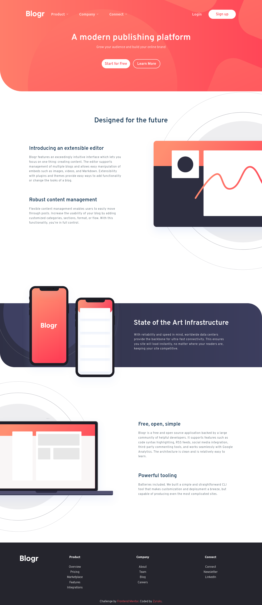

# Frontend Mentor - Blogr landing page

## Table of contents

- [Overview](#overview)
  - [The challenge](#the-challenge)
  - [Screenshot](#screenshot)
  - [Links](#links)
- [My process](#my-process)

  - [Built with](#built-with)
  - [What I learned](#what-i-learned)

  - [Useful resources](#useful-resources)

- [Author](#author)

## Overview

### The challenge

Users should be able to:

- View the optimal layout for the site depending on their device's screen size
- See hover states for all interactive elements on the page

Additional i added some animations.

### Screenshot

<div style="display:flex; gap: 1rem; ">


</div>

### Links

- Solution URL: [Github](https://github.com/Zyruks/frontend-mentor-blogr-landing-page)
- Live Site URL: [Vercel](https://frontend-mentor-blogr-landing-page-git-main-zyruks.vercel.app/)


## My process

### Built with

- Semantic HTML5 markup
- SCSS
- GULP
- Vanilla Js
- Stylelint
- BEM
- CSS custom properties
- Flexbox
- CSS Grid
- Mobile-first workflow

### What I learned

What i learn is how to get a background gradient and a background image on same background and move it around

```
img {
 background: url("../assets/images/bg-pattern-intro-mobile.svg"),
    linear-gradient(
      140deg,
      var(--mobile-gradient-one) 0%,
      var(--mobile-gradient-two) 80%
    );
  background-repeat: no-repeat;
  background-position: 35% 35%;
  background-size: 300%;
}

```

### Useful resources

- [CSSTRICK](https://css-tricks.com/almanac/properties/b/background/) - This help with the understanding of background properties.

## Author

- Website - [Zyruks](https://www.zyruks.com)
- Frontend Mentor - [@zyruks](https://www.frontendmentor.io/profile/zyruks)
- Twitter - [@zyruks](https://www.twitter.com/zyruks)
