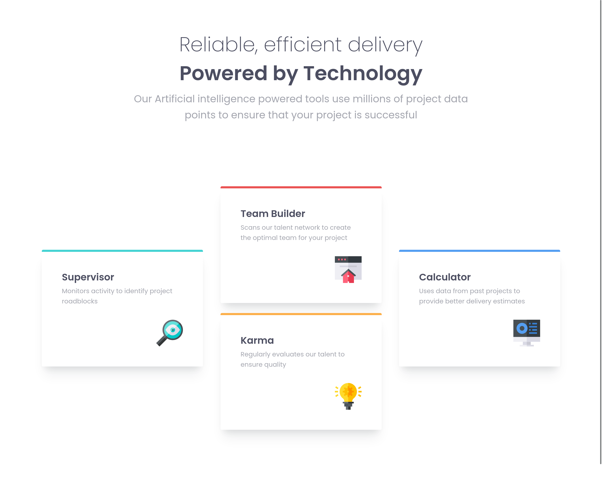
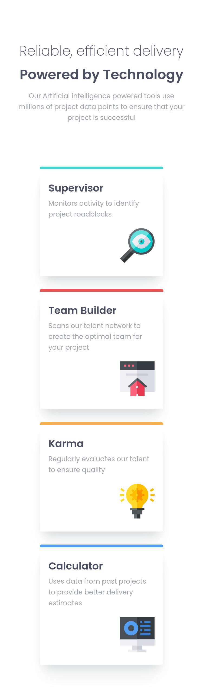

# Frontend Mentor - Four Card Feature Section

This is a solution to the [Four card feature section challenge on Frontend Mentor](https://www.frontendmentor.io/challenges/four-card-feature-section-weK1eFYK). Frontend Mentor challenges help you improve your coding skills by building realistic projects.

## Table of contents

- [Overview](#overview)
  - [The challenge](#the-challenge)
  - [Screenshot](#screenshot)
  - [Links](#links)
- [My process](#my-process)
  - [Built with](#built-with)
  - [What I learned](#what-i-learned)
  - [Continued development](#continued-development)
  - [Useful resources](#useful-resources)
- [Author](#author)

## Overview

### The challenge

Users should be able to:

- View the optimal layout for the site depending on their device's screen size
- See hover states for all interactive elements on the page

### Screenshot

### Links

- Solution URL: [Github](https://github.com/Zyruks/frontend-mentor-four-card-feature-section)
- Live Site URL: [Vercel](https://frontend-mentor-four-card-feature-section-nuywr0vvw-zyruks.vercel.app/)

## My process

### Built with

- Semantic HTML5 markup
- SCSS
- GULP
- Stylelint
- CUBE-CSS
- CSS custom properties
- CSS GRID
- CSS Grid
- Mobile-first workflow

### What I learned

This is a Basic component nothing new but im practicing CUBE-CSS.attribution
Trying to adapt this methodology to my workflow.

### Continued development

The CubeCSS Methodology, Check it out at [CUBE-CSS](https://cube.fyi/)

## Author

- Website - [Zyruks](https://www.zyruks.com)
- Frontend Mentor - [@zyruks](https://www.frontendmentor.io/profile/zyruks)
- Twitter - [@zyruks](https://www.twitter.com/zyruks)
