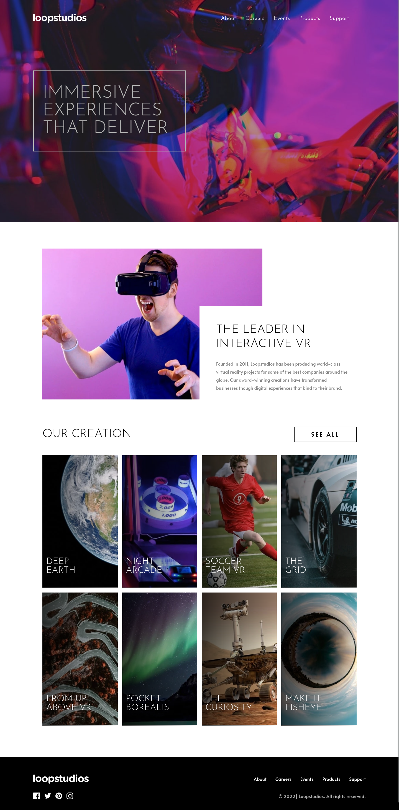
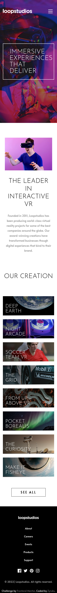

# Frontend Mentor - Loopstudios landing page solution

This is a solution to the [Loopstudios landing page challenge on Frontend Mentor](https://www.frontendmentor.io/challenges/loopstudios-landing-page-N88J5Onjw). Frontend Mentor challenges help you improve your coding skills by building realistic projects.

## Table of contents

- [Overview](#overview)
  - [The challenge](#the-challenge)
  - [Screenshot](#screenshot)
  - [Links](#links)
- [My process](#my-process)
  - [Built with](#built-with)
  - [What I learned](#what-i-learned)
  - [Continued development](#continued-development)
  - [Useful resources](#useful-resources)
- [Author](#author)

## Overview

### The challenge

Users should be able to:

- View the optimal layout for the site depending on their device's screen size
- See hover states for all interactive elements on the page

### Screenshot

<div style="display:flex; gap: 1rem; ">


</div>

### Links

- Solution URL: [Github](https://github.com/Zyruks/frontend-mentor-loopstudios-landing-page)
- Live Site URL: [Vercel](https://frontend-mentor-loopstudios-landing-page-zyruks.vercel.app/)

## My process

### Built with

- Semantic HTML5 markup
- SCSS
- GULP
- Vanilla Js
- Stylelint
- BEM
- CSS custom properties
- Flexbox
- CSS Grid
- Mobile-first workflow

### What I learned

This is something i got from photoshop and i try on CSS and work the mix-blend-mode: multiply to get a slightly darker area of the picture with a gradient. Work just like i though.

if you want to check out the full class go to scss folder /layout/\_grid-gallery.scss

```
  background: linear-gradient(
    90deg,
    var(--clr-neutral-800) 0%,
    var(--clr-neutral-100) 100%
  );
  mix-blend-mode: multiply;

```

### Continued development

Doing more stuff with background properties. Got some ideas for new projects now.

### Useful resources

- [CSSTRICK](https://css-tricks.com/almanac/properties/m/mix-blend-mode/) -

## Author

- Website - [Zyruks](https://www.zyruks.com)
- Frontend Mentor - [@zyruks](https://www.frontendmentor.io/profile/zyruks)
- Twitter - [@zyruks](https://www.twitter.com/zyruks)
