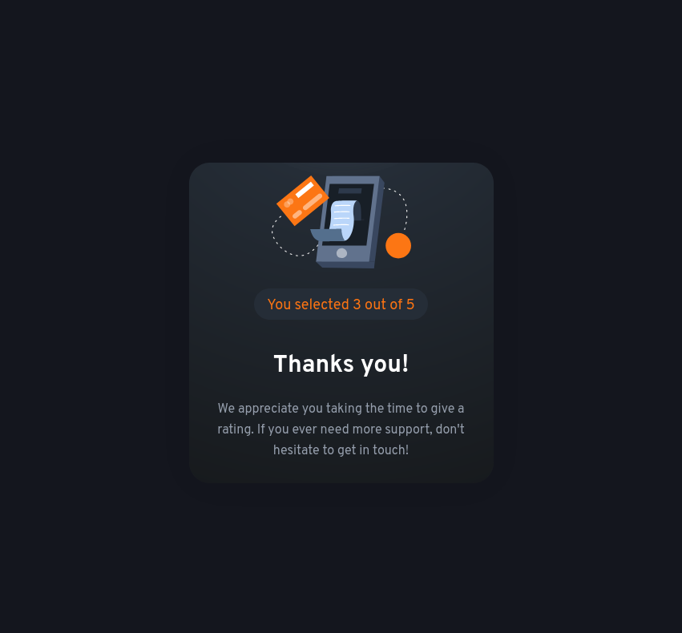

# Frontend Mentor - interactive Rating Component Solution

This is a solution to the [Interactive Rating Component challenge on Frontend Mentor](https://www.frontendmentor.io/challenges/interactive-rating-component-koxpeBUmI). Frontend Mentor challenges help you improve your coding skills by building realistic projects.

## Table of contents

- [Overview](#overview)
  - [The challenge](#the-challenge)
  - [Screenshot](#screenshot)
  - [Links](#links)
- [My process](#my-process)

  - [Built with](#built-with)
  - [What I learned](#what-i-learned)
  - [Useful resources](#useful-resources)

- [Author](#author)

## Overview

### The challenge

Users should be able to:

- Select and submit a number rating
- See the "Thank you" card state after submitting a rating
- View the optimal layout for the app depending on their device's screen size
- See hover states for all interactive elements on the page

### Screenshot





### Links

- [Live Solution](https://interactive-rating-component-ez3lqn595-zyruks.vercel.app/)
- [Github](https://your-live-site-url.com)

## My process

### Built with

- SASS Pre-processor
- CSS custom properties
- Flex-box
- Responsive Image - Picture Tag
- Mobile-first workflow
- Vanilla Javascript
- [Gulp](https://gulpjs.com/) - WorkFlow
- [Pnpm](https://pnpm.io/) - Package Manager

### What I learned

Work with gradient and move it around.

```
background: radial-gradient(
    circle at 50% -40%,
    hsla(216deg, 12%, 54%, 50%) 0%,
    hsla(213deg, 20%, 18%, 100%) 30%,

    rgb(23, 26, 29) 100%
  );
```

### Continue Development

I added a error block if the user don't select a score.

### Useful resources

- [w3sSchool](https://www.w3schools.com/css/css3_gradients.asp) - Help with the background for review class.

## Author

- Website - [Zyruks](https://zyruks.com)
- Frontend Mentor - [@Zyruks](https://www.frontendmentor.io/profile/Zyruks)
- Twitter - [@Zyruks](https://www.twitter.com/zyruks)
