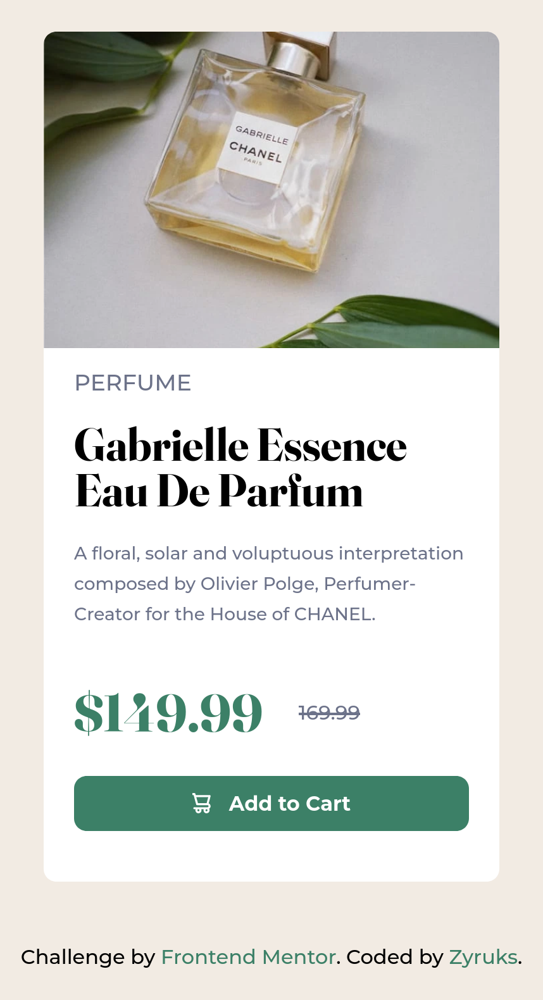
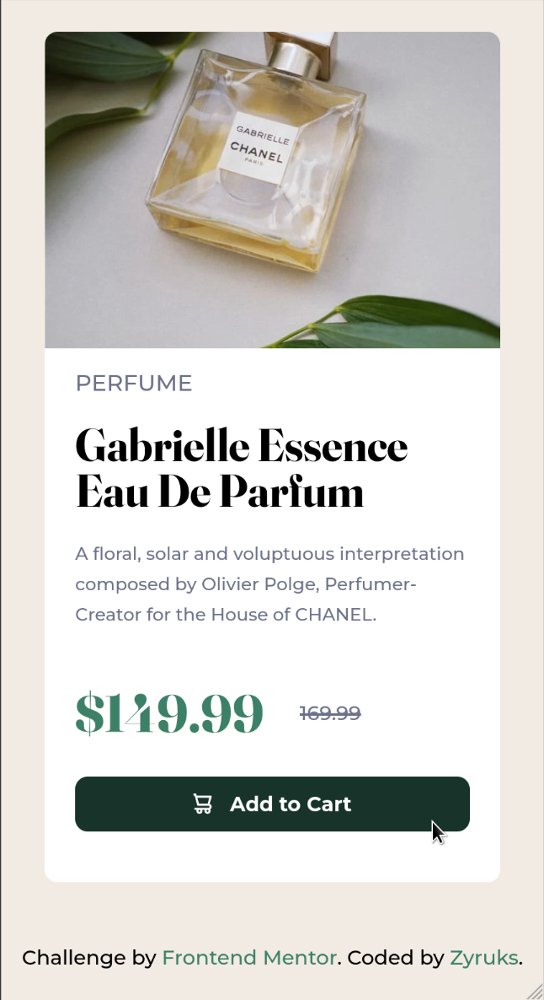
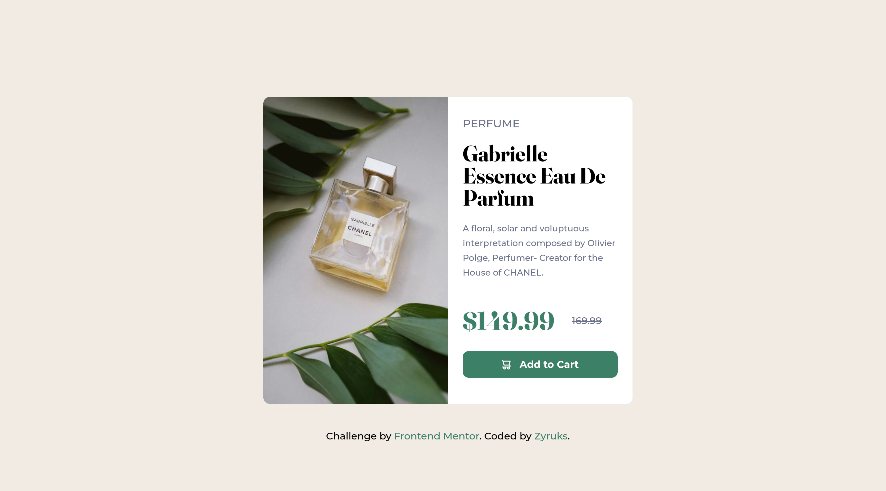
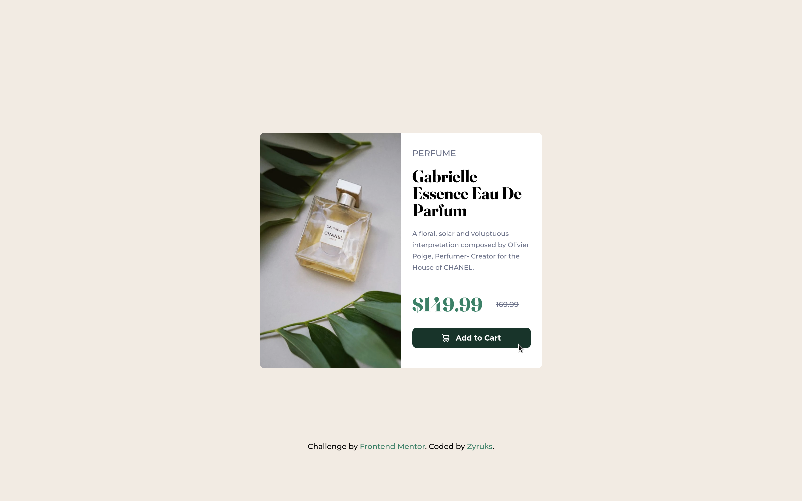

# Frontend Mentor - Product preview card component solution

This is a solution to the [Product preview card component challenge on Frontend Mentor](https://www.frontendmentor.io/challenges/product-preview-card-component-GO7UmttRfa). Frontend Mentor challenges help you improve your coding skills by building realistic projects.

## Table of contents

- [Overview](#overview)
  - [The challenge](#the-challenge)
  - [Screenshot](#screenshot)
  - [Links](#links)
- [My process](#my-process)
  - [Built with](#built-with)
  - [What I learned](#what-i-learned)
  - [Continued development](#continued-development)
  - [Useful resources](#useful-resources)
- [Author](#author)

## Overview

### The challenge

Users should be able to:

- View the optimal layout depending on their device's screen size
- See hover and focus states for interactive elements

### Screenshot






### Links

- Solution URL: [Add solution URL here](https://your-solution-url.com)
- Live Site URL: [Add live site URL here](https://your-live-site-url.com)

## My process

### Built with

- SASS Pre-processor
- CSS custom properties
- Flex-box
- Responsive Image - Picture Tag
- Mobile-first workflow
- [Gulp](https://gulpjs.com/) - WorkFlow
- [Pnpm](https://pnpm.io/) - Package Manager

### What I learned

I manage to work with the picture tag i learn how to optimize images and change it depending on design decisions.

```html
<picture>
  <source
    srcset="./assets/images/image-product-desktop-lg.webp"
    media="(min-width: 1334px)"
  />
  <source
    srcset="./assets/images/image-product-desktop-lg.jpg"
    media="(min-width: 1334px)"
  />

  <source
    srcset="./assets/images/image-product-mobile-lg.webp"
    media="(min-width: 370px)"
  />
  <source
    srcset="./assets/images/image-product-mobile-lg.jpg"
    media="(min-width: 370px)"
  />
  
</picture>
```

```scss
.card__img-wrapper {
  border-radius: rem(10) rem(10) rem(0) rem(0);

  overflow: hidden;
  block-size: rem(250);

  @include breakpoint(x-large) {
    border-radius: rem(10) rem(0) rem(0) rem(10);
    block-size: rem(500);
    inline-size: 100%;

    line-height: 0; // Trick to not display the picture tag.
  }
}
```

To be exact the line-height: 0; trick.

### Continued development

I need more practice with the picture tag, I would like to have more control over this tag.

### Useful resources

- [CSSTRICK](https://css-tricks.com/a-guide-to-the-responsive-images-syntax-in-html/) - helped me with the Picture tag and how to work it.

## Author

- Website - [Zyruks](https://zyruks.com)
- Frontend Mentor - [@Zyruks](https://www.frontendmentor.io/profile/Zyruks)
- Twitter - [@Zyruks](https://www.twitter.com/zyruks)
