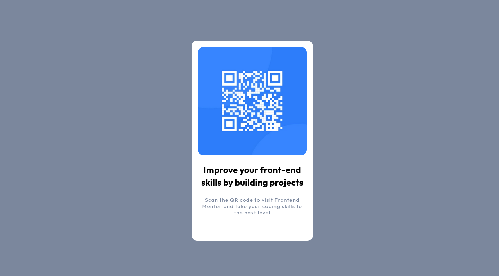

# Frontend Mentor - interactive Rating Component Solution

This is a solution to the [QR code component](https://www.frontendmentor.io/challenges/qr-code-component-iux_sIO_H). Frontend Mentor challenges help you improve your coding skills by building realistic projects.

## Table of contents

- [Overview](#overview)

  - [Screenshot](#screenshot)
  - [Links](#links)

- [My process](#my-process)
  - [Built with](#built-with)
  - [What I learned](#what-i-learned)
  - [Useful resources](#useful-resources)
- [Author](#author)

## Overview

### Screenshot

### Links

- [Live Solution](https://vercel.com/zyruks/front-end-mentor/Ea5ozyGzRfnPUTgqUqLro4wgv53a)
- [Github](https://github.com/Zyruks/front-end-mentor/tree/main/qr-code-component)

## My process

### Built with

- SASS Pre-processor
- CSS custom properties
- Flex-box
- Responsive Image - Picture Tag
- Mobile-first workflow
- [Gulp](https://gulpjs.com/) - WorkFlow
- [Pnpm](https://pnpm.io/) - Package Manager

### What I learned

Nothing new here :/

## Author

- Website - [Zyruks](https://zyruks.com)
- Frontend Mentor - [@Zyruks](https://www.frontendmentor.io/profile/Zyruks)
- Twitter - [@Zyruks](https://www.twitter.com/zyruks)
