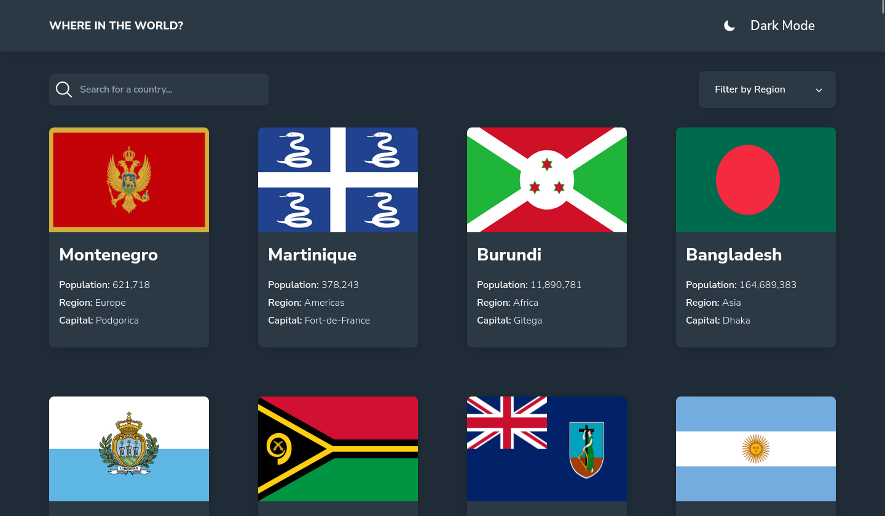
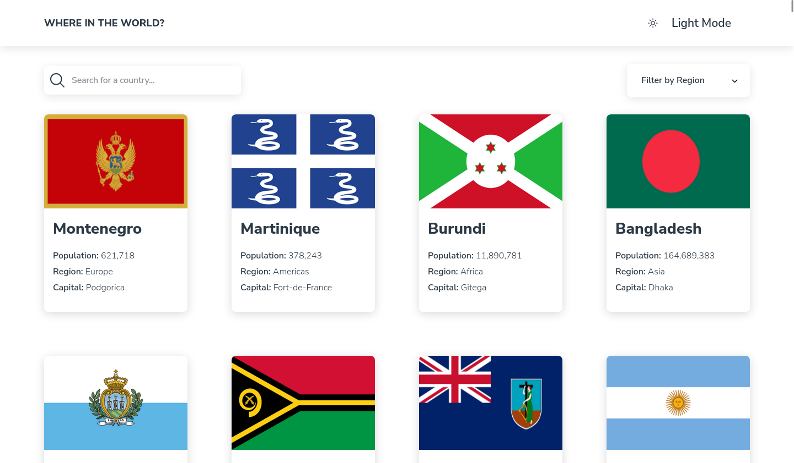
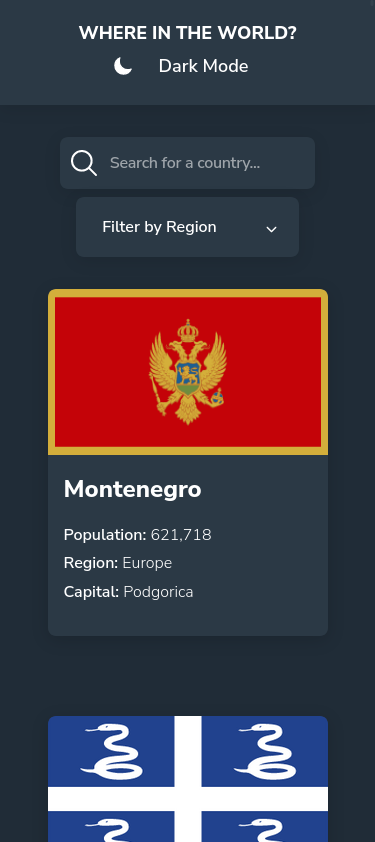
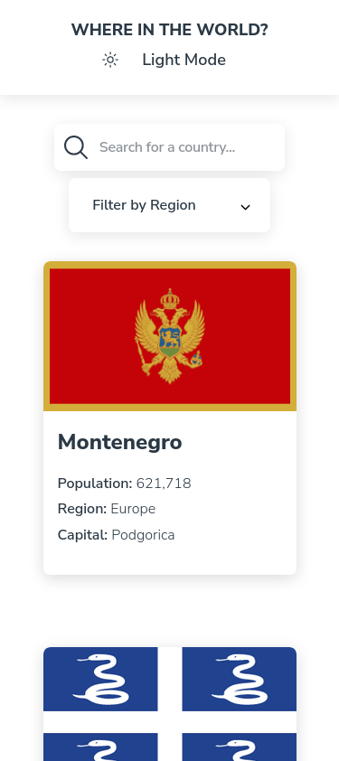

# Frontend Mentor - REST Countries API with color theme switcher solution

This is a solution to the [REST Countries API with color theme switcher challenge on Frontend Mentor](https://www.frontendmentor.io/challenges/rest-countries-api-with-color-theme-switcher-5cacc469fec04111f7b848ca). Frontend Mentor challenges help you improve your coding skills by building realistic projects.

## Table of contents

- [Overview](#overview)
  - [The challenge](#the-challenge)
  - [Screenshot](#screenshot)
  - [Links](#links)
- [My process](#my-process)
  - [Built with](#built-with)
  - [What I learned](#what-i-learned)
  - [Continued development](#continued-development)
  - [Useful resources](#useful-resources)
- [Author](#author)
- [Acknowledgments](#acknowledgments)

## Overview

### The challenge

Users should be able to:

- See all countries from the API on the homepage
- Search for a country using an `input` field
- Filter countries by region
- Click on a country to see more detailed information on a separate page
- Click through to the border countries on the detail page
- Toggle the color scheme between light and dark mode _(optional)_

### Screenshot






### Links

- Solution URL: [Github](https://github.com/Zyruks/rest-countries-api)
- Live Site URL: [Vercel](https://rest-countries-api-zyruks.vercel.app/)

## My process

### Built with

- Semantic HTML5 markup
- CSS custom properties
- Flexbox
- CSS Grid
- Mobile-first workflow
- Typescript
- Sass
- CUBECSS
- Responsive
- Accessibility
- Vite

### What I learned

I was practicing Typescript, i just learn Typescript a week ago and i want to try it on a new project

Stuff I learn

```typescript
interface Country {
  name: string
  population: number
  capital: string
  region: string
  subregion: string
  flag: string
  currencies: {
    name: string
  }[]
  languages: string[]
  borders: string[]
  cca3: string
}
```

How to use Interfaces and Types, and how to style the select tag

### Continued development

To achieve my goal of improving my proficiency in TypeScript, I recognize the need to consistently practice coding and seek out learning resources such as online tutorials and engaging in collaborative projects with experienced developers.

### Useful resources

- [Typescript Docs](https://www.typescriptlang.org/docs/) - This helped me find how stuff work in typescript
- [Video 8 hours of Typescript](https://www.youtube.com/results?search_query=typescript+8+hours) - How I start this Journey

## Author

- Website - [Zyruks](https://www.zyruks.com)
- Frontend Mentor - [@zyruks](https://www.frontendmentor.io/profile/zyruks)
- Twitter - [@zyruks](https://www.twitter.com/zyruks)
