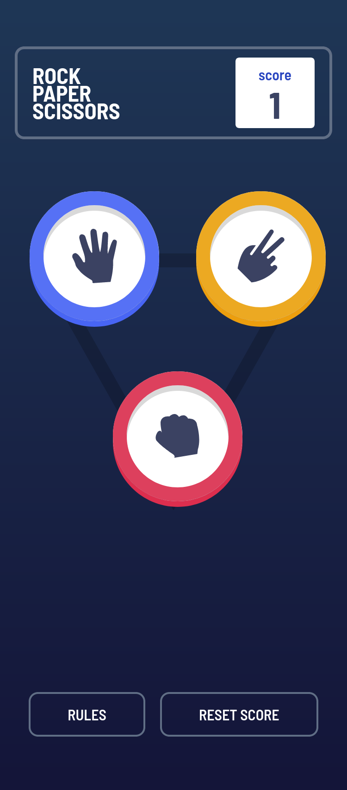
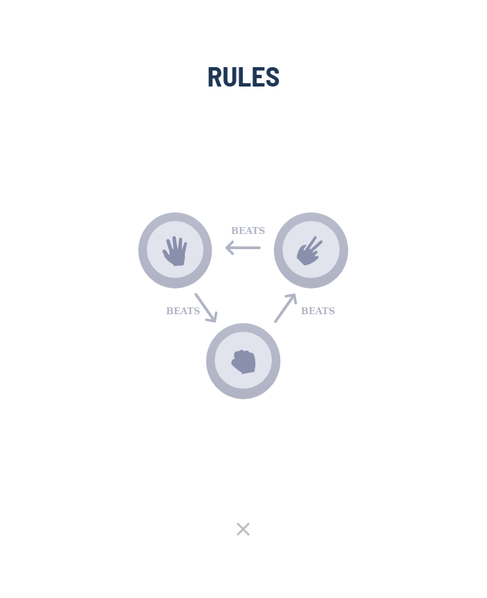
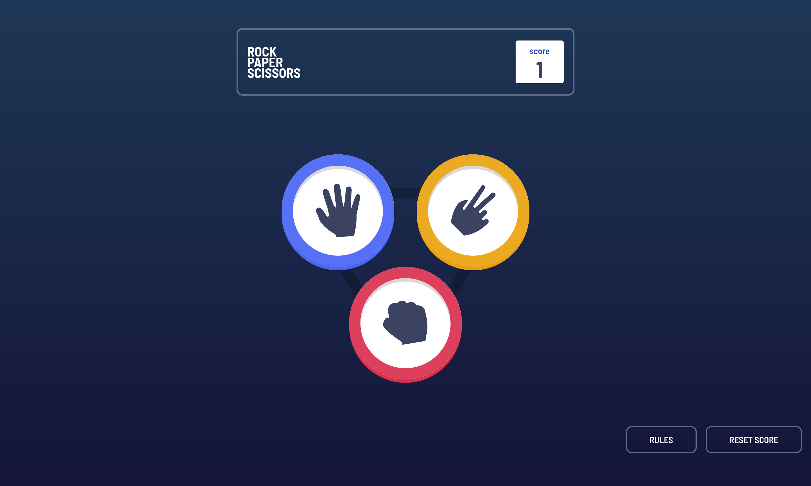
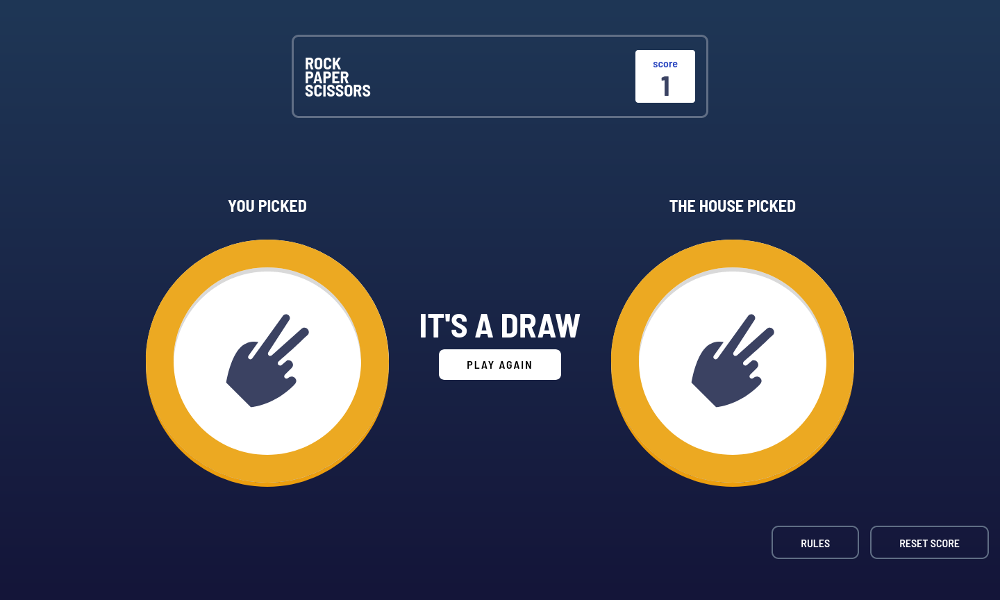
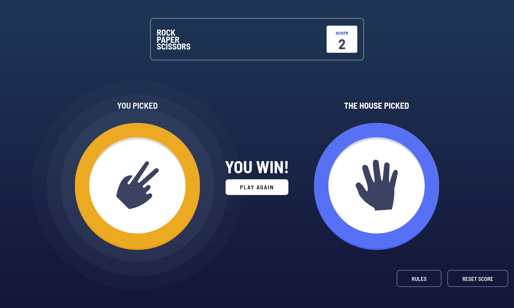
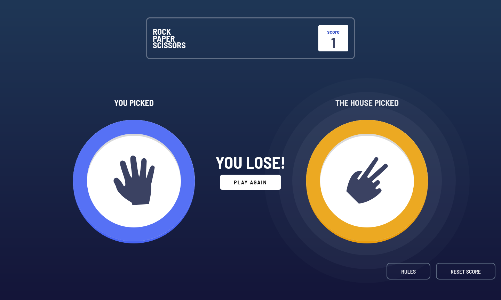
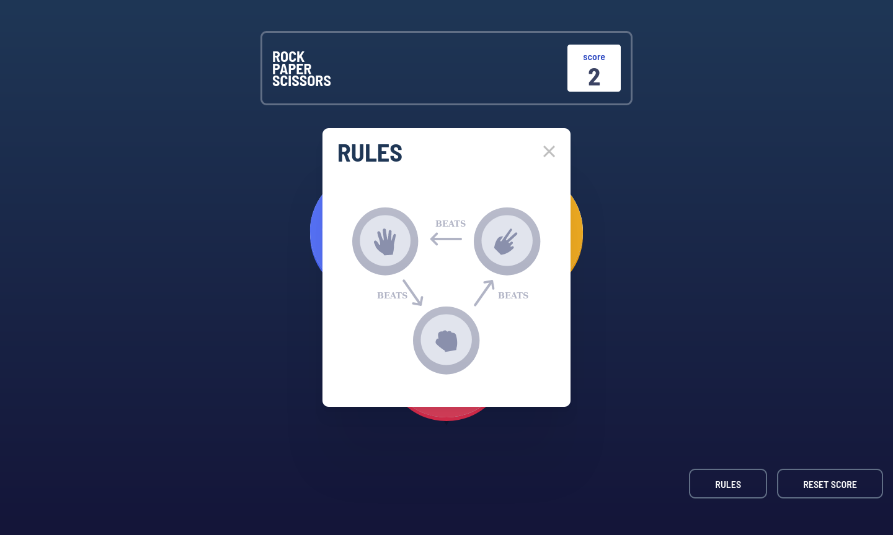

# Frontend Mentor - Rock, Paper, Scissors solution

This is a solution to the [Rock, Paper, Scissors challenge on Frontend Mentor](https://www.frontendmentor.io/challenges/rock-paper-scissors-game-pTgwgvgH). Frontend Mentor challenges help you improve your coding skills by building realistic projects.

## Table of contents

- [Overview](#overview)
  - [The challenge](#the-challenge)
  - [Screenshot](#screenshot)
  - [Links](#links)
- [My process](#my-process)
  - [Built with](#built-with)
  - [What I learned](#what-i-learned)
  - [Continued development](#continued-development)
  - [Useful resources](#useful-resources)
- [Author](#author)

## Overview

### The challenge

Users should be able to:

- View the optimal layout for the game depending on their device's screen size
- Play Rock, Paper, Scissors against the computer
- Maintain the state of the score after refreshing the browser _(optional)_

### Screenshot

### Links

- Solution URL: [GitHub](https://github.com/Zyruks/rock-paper-scissors)
- Live Site URL: [Vercel](https://rock-paper-scissors-zyruks.vercel.app/)

## My process

### Built with

- Semantic HTML5 markup
- CSS custom properties
- Sass
- CUBE CSS
- Flexbox
- CSS Grid
- Mobile-first workflow
- Vanilla CSS
- Object Oriented
- Gulp

### What I learned

I have improve my knowledge in javascript classes and how to work with method more in depth.

I learn about the localStorage property. It was a requirement to maintain the score after refreshing or closing the tab was really intuitive but is the first time using it.

### Continued development

I want to improve the code and change the setTimeout for Promises but i need to read more about to implement this Object but soon this part gonna be complete too.

### Useful resources

- [Javascript Classes](https://javascript.info/class) - I use Object Oriented programming, if you want to learn more about it  you can read about  classes in this website
- [Object Oriented Programins](https://www.geeksforgeeks.org/introduction-object-oriented-programming-javascript/) - More about OOP.

## Author

- Website - [Zyruks](https://www.zyruks.com)
- Frontend Mentor - [@zyruks](https://www.frontendmentor.io/profile/zyruks)
- Twitter - [@zyruks](https://www.twitter.com/zyruks)
